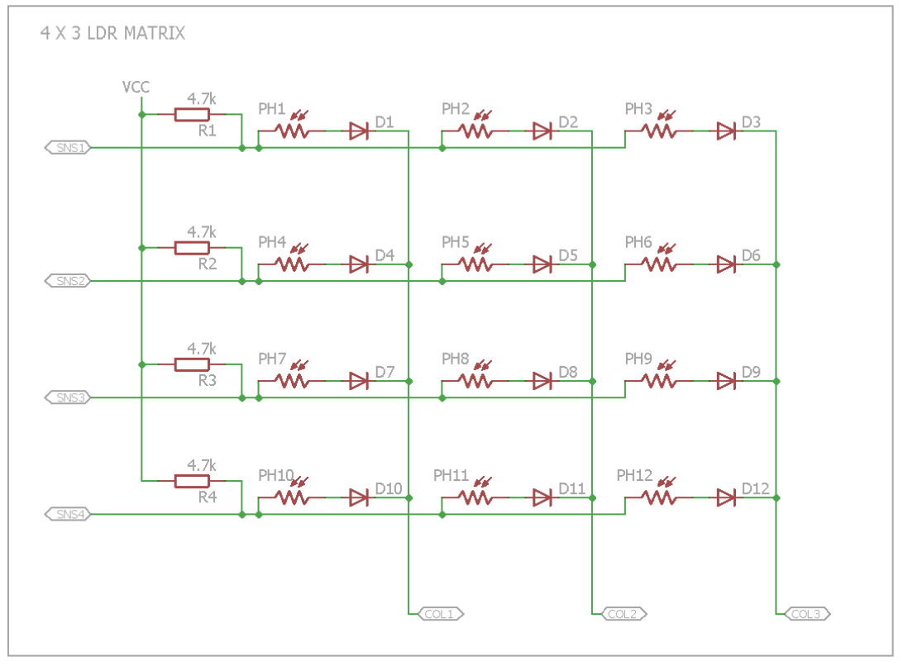
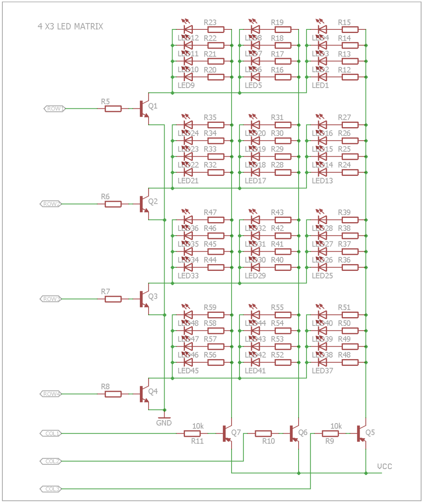

# balloon_driver
LED Balloon Targets is an LED based electronic version of the popular game Shooting Targets. In this game, the player has to shoot at balloon targets using the gun. The LEDs emulate the balloons and a laser gun is used to shoot them. The LED balloons are arranged in a 4 x 3 matrix.
One LED balloon is made of 4 LEDs and an LDR is embedded in the centre. So there is one LDR corresponding to each balloon. The player has to actually aim at the LDR by the laser gun to shoot the LED balloon. All LED balloons are lighted up initially. As soon as laser falls on any LDR, the LEDs of the corresponding balloon turn off. Once all the LED balloons go off, the buzzer is turned on to indicate the same.
Do you have what it takes to be a great shooter? Test your shooting skills using this game. Load the gun, press the trigger and shoot!

Let us first list down the requirements of the proposed project as follows:
- A device to sense the light coming from laser gun.
- An output device to emulate the balloon.
- An output device to indicate that the game is over.
- A microcontroller to do all the processing.
- A supply to power up the whole circuit.

Now we will try to place the above requirements in the six-box model:
1. INPUT: LDR (light-dependent resistor) to detect the change in light when laser falls on it. LDRs are arranged in a 4x3 matrix. 
1. OUTPUTS:
   1. 4 LEDs to emulate one balloon. Bal- loons are also arranged in a 4x3 matrix. 
   2. Buzzer to indicate that the game is complete i.e. all LED balloons have been shot at.
1. MICROCONTROLLER: The microcontroller used is ESP32 Wroom32.
1. POWER SUPPLY: For keeping the project portable, the power is supplied through a USB Mini B connector, which brings in a raw 5V. This voltage is not suitable to be fed directly to the ESP32. Therefore, LM1117 LDO voltage regulator that gives 3.3V output is used.
1. COMMUNICATION: A 4-pin connector, with Test, Reset, Vcc and GND signals, is provided for downloading code from the emulator. This ensures that the user doesn't have to disconnect the microcontroller from the PCB repeatedly to code it.
