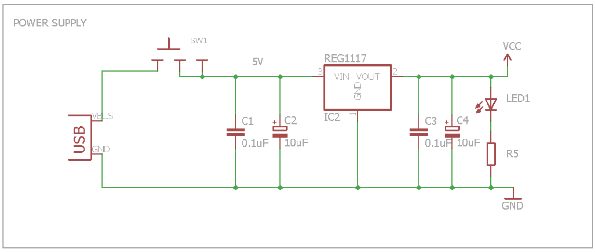
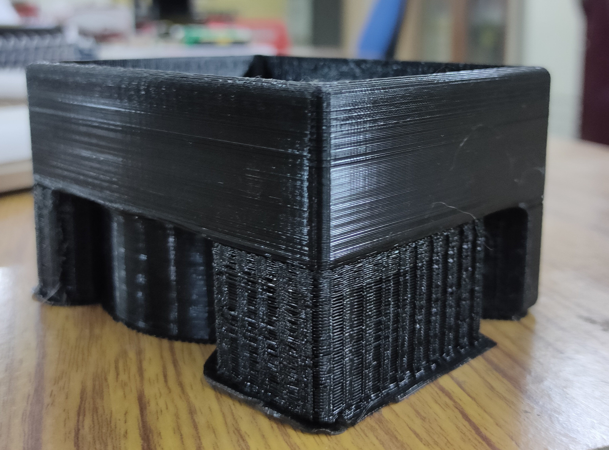
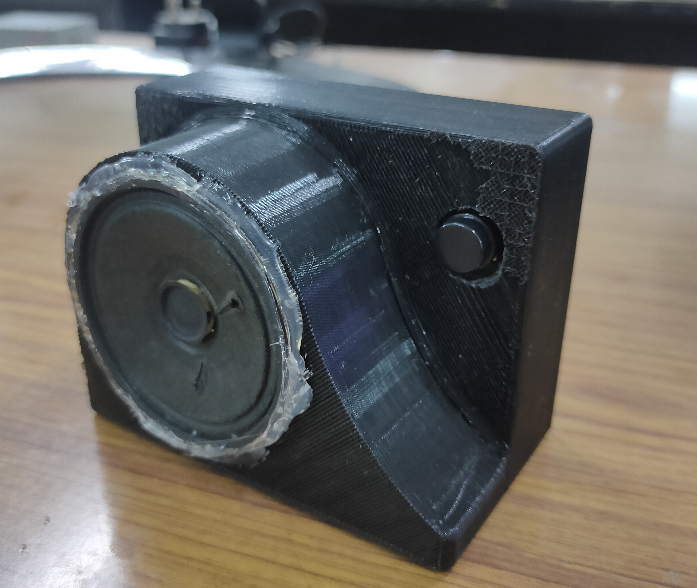

# balloon_driver
LED Balloon Targets is an LED based electronic version of the popular game Shooting Targets. In this game, the player has to shoot at balloon targets using the gun. The LEDs emulate the balloons and a laser gun is used to shoot them. The LED balloons are arranged in a 4 x 3 matrix.
One LED balloon is made of 4 LEDs and an LDR is embedded in the centre. So there is one LDR corresponding to each balloon. The player has to actually aim at the LDR by the laser gun to shoot the LED balloon. All LED balloons are lighted up initially. As soon as laser falls on any LDR, the LEDs of the corresponding balloon turn off. Once all the LED balloons go off, the buzzer is turned on to indicate the same.
Do you have what it takes to be a great shooter? Test your shooting skills using this game. Load the gun, press the trigger and shoot!

Let us first list down the requirements of the proposed project as follows:
- A device to sense the light coming from laser gun.
- An output device to emulate the balloon.
- An output device to indicate that the game is over.
- A microcontroller to do all the processing.
- A supply to power up the whole circuit.

Now we will try to place the above requirements in the six-box model:
1. INPUT: LDR (light-dependent resistor) to detect the change in light when laser falls on it. LDRs are arranged in a 4x3 matrix. 
1. OUTPUTS:
   1. 4 LEDs to emulate one balloon. Bal- loons are also arranged in a 4x3 matrix. 
   2. Buzzer to indicate that the game is complete i.e. all LED balloons have been shot at.
1. MICROCONTROLLER: The microcontroller used is ESP32 Wroom32.
1. POWER SUPPLY: For keeping the project portable, the power is supplied through a USB Mini B connector, which brings in a raw 5V. This voltage is not suitable to be fed directly to the ESP32. Therefore, LM1117 LDO voltage regulator that gives 3.3V output is used.
1. COMMUNICATION: A 4-pin connector, with Test, Reset, Vcc and GND signals, is provided for downloading code from the emulator. This ensures that the user doesn't have to disconnect the microcontroller from the PCB repeatedly to code it.

## Block Diagram

## Hardware Description
The hardware of our project comprises of two boards: 
1. Driver circuit board - Consisting of power supply, ESP32 microcontroller, buzzer and connectors.
2. LED Balloon board - Consisting of 4 x 3 LDR matrix and 4 x 3 LED balloon matrix and connectors. The LED Balloon board is stacked above the driver circuit. For this purpose, suitable connectors have been provided.

The working of the project involves the concept of multiplexing. So, before proceeding further one must know how multiplexing works.
- Multiplexing is a technique of driving large number of LEDs using only a few pins of the microcontroller. In multiplexing a set of LEDs are lit for a brief period of time, then the next set is lit, then another set and hence the cycle repeats. This continuous switching ON and OFF of LEDs is done at a rate such that it exceeds the persistence of vision and the human eye perceives all the LEDs to be ON simultaneously.
- The 4x3 matrix consists of 12 elements. The following circuit corresponds to one element of the matrix:
- Each LED balloon is made up of 4 LEDs which are connected in parallel as shown.
- An NPN transistor, BC547, has been used for low-side switching. It provides the necessary current sinking capabilities required to drive the LEDs.
- A PNP transistor, BC557, has been used for high-side switching. It provides the necessary current sourcing capabilities required to drive the LEDs.
- The SNS1 pin reads the voltage at that point using ADC. When laser light falls on the LDR, its resistance decreases, current through it increases and voltage at SNS1 pin decreases.
- So, if the voltage value at SNS1 pin is above a certain threshold value then ROW1 pin is made high, while COL1 pin is kept low. Hence all the 4 LEDs that make up one balloon light up.
- If the voltage value at SNS1 pin is below a certain threshold value then ROW1 pin is made low, while COL1 pin is kept low. Hence all the 4 LEDs that make up one balloon turn off.
- We deal with only one column at a time. Initially, first column is activated by keeping COL1 low, COL2 and COL3 are kept high, then SNS1, SNS2, SNS3, SNS4 pins are read for the four rows and the corresponding ROW pin is made high or low accordingly. Same procedure is repeated for second and third column too.

## Flowchart

## Circuit Design
### Driver Circuit
||
|:--:|
|*Driver board schematic*|

||
|:--:|
|*Driver board layout*|

### LED Balloon Circuit
||
|:--:|
|*Balloon board schematic*|

||
|:--:|
|*Balloon board layout*|

## Fabricated PCB
|||
|:--:|:--:|
|*Driver board(top)*|*Driver board(bottom)*|
|||
|*Balloon board(top)*|*Balloon board(bottom)*|

## 3D Enclosure
|||
|:--:|:--:|
|||

## Working Video

